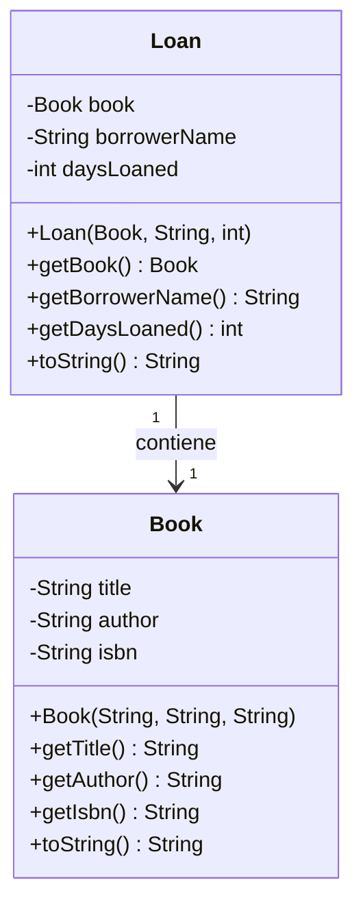
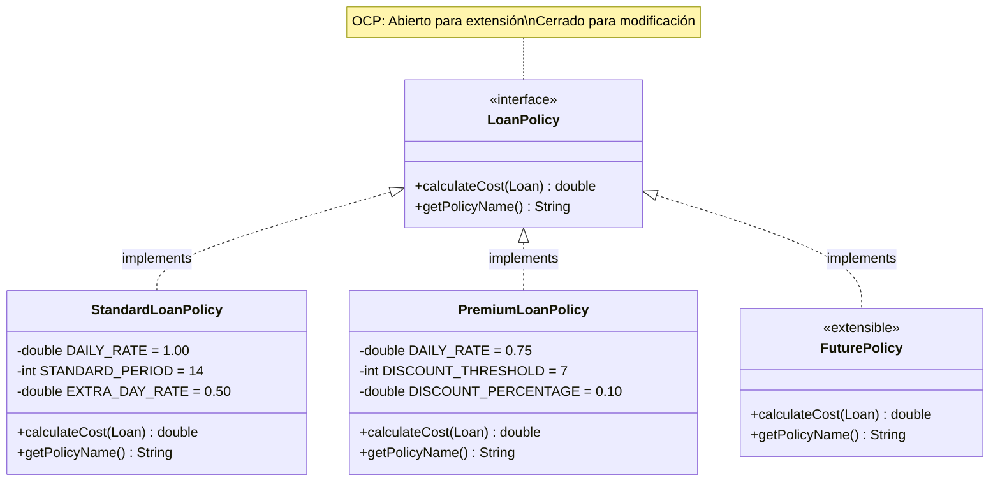
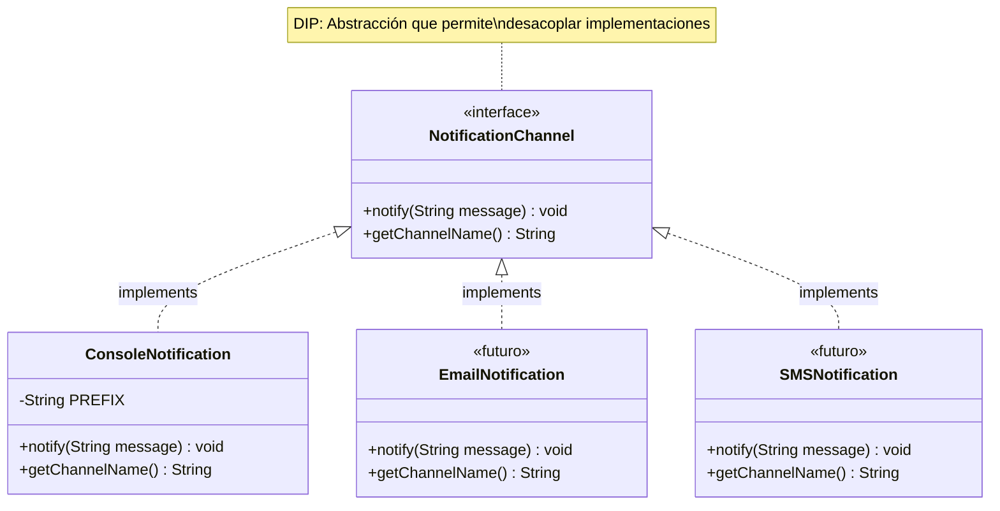
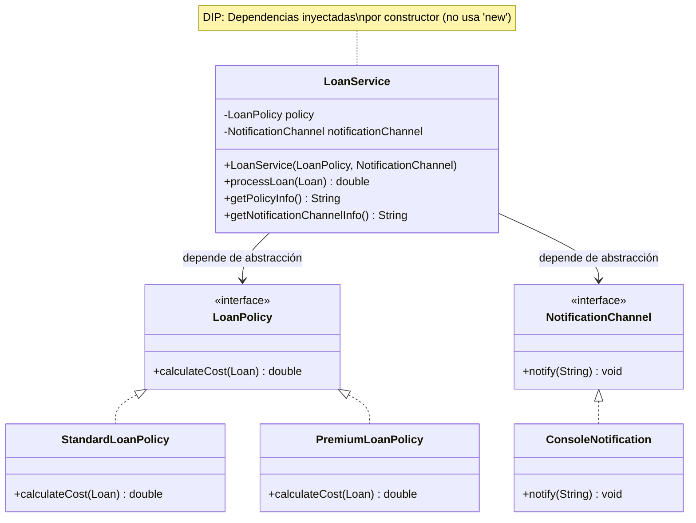
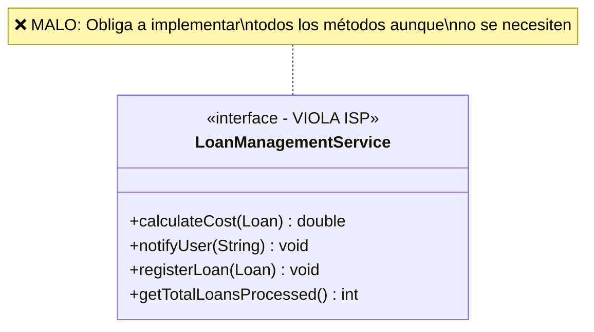
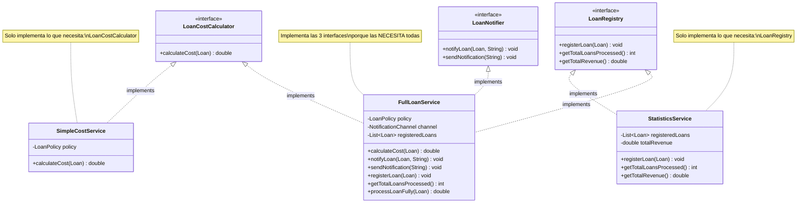
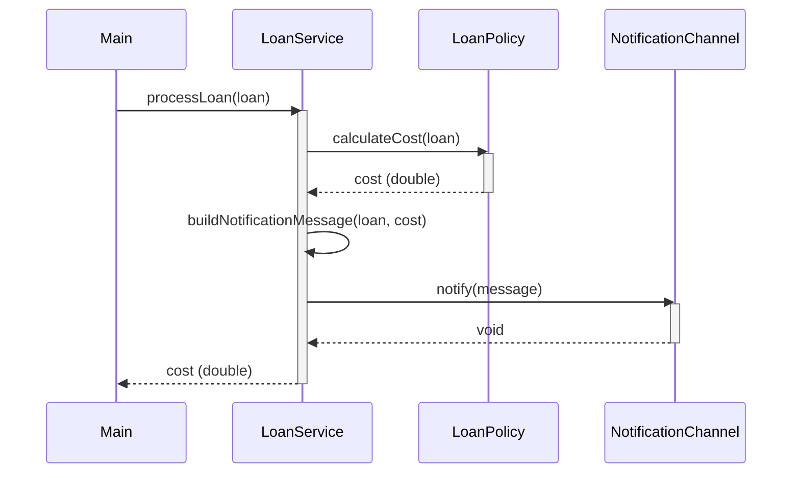
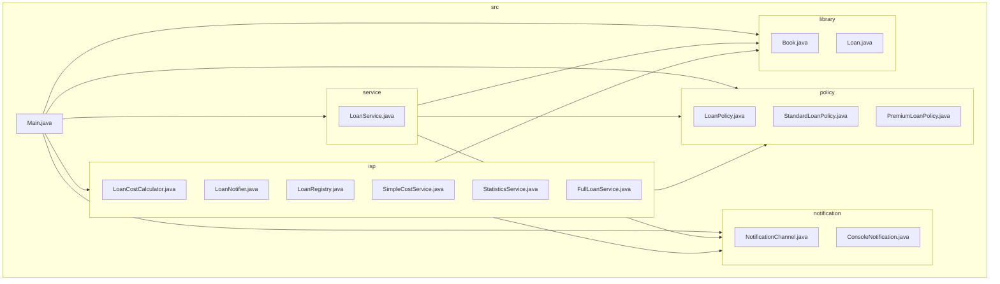

# Práctica 1 - Diseño Orientado a Objetos y Principios SOLID

## Universidad de La Laguna
### Grado en Ingeniería Informática
### Modelado de Sistemas Software - Curso 2025-2026

---

## 📋 Índice

1. [Descripción](#descripción)
2. [Estructura del Proyecto](#estructura-del-proyecto)
3. [Diagramas UML](#diagramas-uml)
4. [Principios SOLID Aplicados](#principios-solid-aplicados)
5. [Cómo Ejecutar](#cómo-ejecutar)
6. [Pruebas Realizadas](#pruebas-realizadas)

---

## Descripción

Sistema de gestión de préstamos de biblioteca que demuestra la aplicación de los **principios SOLID** en Java:

- **S**ingle Responsibility Principle (SRP)
- **O**pen/Closed Principle (OCP)
- **L**iskov Substitution Principle (LSP)
- **I**nterface Segregation Principle (ISP)
- **D**ependency Inversion Principle (DIP)

---

## Estructura del Proyecto

```
practica1_solid/
└── src/
    ├── Main.java                    # Punto de entrada y pruebas
    │
    ├── library/                     # Modelo de dominio (Ejercicio 1 - SRP)
    │   ├── Book.java               # Representa un libro
    │   └── Loan.java               # Representa un préstamo
    │
    ├── policy/                      # Políticas de préstamo (Ejercicio 2 - OCP)
    │   ├── LoanPolicy.java         # Interfaz de política
    │   ├── StandardLoanPolicy.java # Política estándar
    │   └── PremiumLoanPolicy.java  # Política premium
    │
    ├── notification/                # Sistema de notificaciones (Ejercicio 3 - DIP)
    │   ├── NotificationChannel.java    # Interfaz de canal
    │   └── ConsoleNotification.java    # Implementación consola
    │
    ├── service/                     # Servicios de negocio (Ejercicio 3 - DIP)
    │   └── LoanService.java        # Servicio principal
    │
    └── isp/                         # Interfaces segregadas (Ejercicio 4 - ISP)
        ├── LoanCostCalculator.java  # Interfaz cálculo
        ├── LoanNotifier.java        # Interfaz notificación
        ├── LoanRegistry.java        # Interfaz registro
        ├── SimpleCostService.java   # Solo calcula costes
        ├── StatisticsService.java   # Solo estadísticas
        └── FullLoanService.java     # Implementa todo
```

---

## Diagramas UML

### Diagrama de Clases General



### Diagrama de Políticas (OCP + LSP)



### Diagrama de Notificaciones (DIP)



### Diagrama de LoanService (DIP - Inyección de Dependencias)



### Diagrama ISP - Comparación Interfaz Monolítica vs Segregada



### Diagrama ISP - Interfaces Segregadas (Solución Correcta)



### Diagrama de Secuencia - Procesar Préstamo



### Diagrama de Paquetes



---

## Principios SOLID Aplicados

### 1. SRP - Single Responsibility Principle (Ejercicio 1)

**"Una clase debe tener una, y solo una, razón para cambiar"**

| Clase | Responsabilidad | ¿Qué NO hace? |
|-------|-----------------|---------------|
| `Book` | Representar datos de un libro | No gestiona préstamos, no calcula costes |
| `Loan` | Representar datos de un préstamo | No calcula costes, no envía notificaciones |

```java
// Book tiene UNA responsabilidad: representar un libro
public class Book {
    private final String title;
    private final String author;
    private final String isbn;
    // Solo getters, representa datos
}

// Loan tiene UNA responsabilidad: representar un préstamo
public class Loan {
    private final Book book;
    private final String borrowerName;
    private final int daysLoaned;
    // Solo getters, representa datos
}
```

### 2. OCP - Open/Closed Principle (Ejercicio 2)

**"Las entidades software deben estar abiertas para extensión, pero cerradas para modificación"**

```java
// Interfaz que define el contrato (cerrada para modificación)
public interface LoanPolicy {
    double calculateCost(Loan loan);
}

// Nueva política = Nueva clase (abierto para extensión)
// NO modificamos código existente
public class StudentLoanPolicy implements LoanPolicy {
    @Override
    public double calculateCost(Loan loan) {
        return loan.getDaysLoaned() * 0.50; // Descuento estudiante
    }
}
```

### 3. LSP - Liskov Substitution Principle (Ejercicio 2)

**"Los subtipos deben ser sustituibles por sus tipos base"**

```java
// Cualquier LoanPolicy puede sustituir a otra
LoanPolicy policy = new StandardLoanPolicy();
double cost1 = policy.calculateCost(loan);

policy = new PremiumLoanPolicy();  // Sustituimos sin problemas
double cost2 = policy.calculateCost(loan);
// El programa sigue funcionando correctamente
```

### 4. DIP - Dependency Inversion Principle (Ejercicio 3)

**"Depende de abstracciones, no de implementaciones concretas"**

```java
public class LoanService {
    // Dependemos de INTERFACES (abstracciones)
    private final LoanPolicy policy;
    private final NotificationChannel notificationChannel;
    
    // Inyección por constructor
    public LoanService(LoanPolicy policy, NotificationChannel channel) {
        this.policy = policy;
        this.notificationChannel = channel;
    }
    
    // NO hacemos esto (violaría DIP):
    // private final ConsoleNotification channel = new ConsoleNotification();
}
```

### 5. ISP - Interface Segregation Principle (Ejercicio 4)

**"Los clientes no deben verse forzados a depender de interfaces que no usan"**

```java
// ❌ MAL: Interfaz monolítica
interface LoanManagementService {
    double calculateCost(Loan loan);     // No todos lo necesitan
    void notifyUser(String message);     // No todos lo necesitan
    void registerLoan(Loan loan);        // No todos lo necesitan
    int getTotalLoansProcessed();        // No todos lo necesitan
}

// ✓ BIEN: Interfaces segregadas
interface LoanCostCalculator {
    double calculateCost(Loan loan);
}

interface LoanNotifier {
    void notifyLoan(Loan loan, String msg);
}

interface LoanRegistry {
    void registerLoan(Loan loan);
    int getTotalLoansProcessed();
}

// Cada servicio implementa SOLO lo que necesita
class SimpleCostService implements LoanCostCalculator { ... }
class StatisticsService implements LoanRegistry { ... }
class FullLoanService implements LoanCostCalculator, LoanNotifier, LoanRegistry { ... }
```

---

## Cómo Ejecutar

### Requisitos
- Java JDK 11 o superior

### Compilación y Ejecución

```bash
# 1. Navegar al directorio del proyecto
cd practica1_solid

# 2. Compilar todos los archivos
javac src/**/*.java

# 3. Ejecutar el programa
java -cp src Main
```

### Salida Esperada

El programa ejecutará automáticamente todas las pruebas y mostrará:
- Pruebas del Ejercicio 1 (SRP)
- Pruebas del Ejercicio 2 (OCP + Polimorfismo)
- Pruebas del Ejercicio 3 (DIP)
- Pruebas del Ejercicio 4 (ISP - Bonus)

---

## Pruebas Realizadas

### Ejercicio 1 - SRP
- ✓ Creación de libros válidos
- ✓ Validación de libro con título vacío
- ✓ Creación de préstamos válidos
- ✓ Validación de préstamo con días negativos
- ✓ Demostración de responsabilidades separadas

### Ejercicio 2 - OCP + Polimorfismo
- ✓ Cálculo con StandardLoanPolicy (préstamo corto)
- ✓ Cálculo con StandardLoanPolicy (préstamo largo con recargo)
- ✓ Cálculo con PremiumLoanPolicy (préstamo corto)
- ✓ Cálculo con PremiumLoanPolicy (préstamo largo con descuento)
- ✓ Polimorfismo: misma variable, diferente comportamiento
- ✓ Demostración de extensibilidad sin modificación

### Ejercicio 3 - DIP
- ✓ Creación de dependencias como abstracciones
- ✓ Inyección de dependencias por constructor
- ✓ Procesamiento de préstamos (cálculo + notificación)
- ✓ Cambio de política sin modificar LoanService
- ✓ Demostración de desacoplamiento

### Ejercicio 4 - ISP (Bonus)
- ✓ SimpleCostService implementa solo LoanCostCalculator
- ✓ StatisticsService implementa solo LoanRegistry
- ✓ FullLoanService implementa las 3 interfaces
- ✓ Ningún servicio tiene métodos vacíos
- ✓ Polimorfismo con interfaces segregadas

---

## Autor

Práctica desarrollada para la asignatura **Modelado de Sistemas Software**  
Grado en Ingeniería Informática  
Universidad de La Laguna

---

## Licencia

LICENCIA MIT